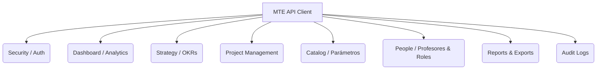

# Documentación Detallada de Endpoints - API PDG MTE

Este documento contiene un catálogo completo y detallado de **TODOS** los endpoints expuestos por la API de **PDG MTE**. Proporciona información sobre cada una de las acciones CRUD (Create, Read, Update, Delete), los parámetros que aceptan, las estructuras de datos que manejan y los permisos/roles necesarios para ejecutarlas.

---

## 🛠️ Resumen de Roles y Permisos
Los endpoints que requieren autenticación y autorización utilizan Spring Security con control de acceso basado en roles (`@PreAuthorize`). Los roles soportados son:
- **`ADMIN`**: Administrador global. Tiene acceso a todas las operaciones, incluyendo CRUD de catálogos, roles, personas y logs de auditoría.
- **`DECANO`**: Decano de facultad. Tiene permisos de visualización global, creación de metas, apuestas estratégicas, proyectos y gestión intermedia.
- **`DIRECTOR_ESCUELA`**: Director de escuela académica. Permisos similares a Decano para la gestión estratégica y proyectos.
- **`JEFE_DPTO`**: Jefe de departamento. Puede ver, actualizar y gestionar proyectos, asociar KR (Key Results) a proyectos, y crear/actualizar objetivos asignados a su departamento.
- **`PROFESOR`**: Profesor/Docente. Puede listar proyectos, crear proyectos en los que participe y reportar avances/progreso.

---

## 📋 Catálogo de Módulos y Endpoints

A continuación se detalla cada controlador de la aplicación.



---

### 1. 🔑 Autenticación y Contexto (`AuthContextController`)
Gestiona la información del usuario autenticado actualmente y sus capacidades en el sistema.

* **Base URL:** `/api/v1/auth`

| Método | Ruta | Descripción | Acceso (PreAuthorize) |
|:---|:---|:---|:---|
| **`GET`** | `/api/v1/auth/me` | Obtiene el contexto detallado, roles y capacidades del usuario logueado. | Público / Autenticado |

#### Detalles:
* **`GET /api/v1/auth/me`**
  * **Respuesta (`AuthMeResponse`):**
    ```json
    {
      "userContext": {
        "externalUserId": "Long",
        "username": "String",
        "email": "String",
        "roles": ["String"],
        "permissions": ["String"],
        "externalProfessorId": "Long",
        "professorName": "String",
        "departmentName": "String"
      },
      "supportedRoles": ["String"],
      "capabilities": ["String"]
    }
    ```

---

### 2. 📊 Tablero de Control (`DashboardController`)
Proporciona métricas agregadas y resúmenes de ejecución para la interfaz principal.

* **Base URL:** `/api/v1/dashboard`
* **Acceso General:** Requiere roles `ADMIN`, `DECANO`, `DIRECTOR_ESCUELA`, `JEFE_DPTO` o `PROFESOR`.

| Método | Ruta | Descripción | Parámetros Query |
|:---|:---|:---|:---|
| **`GET`** | `/api/v1/dashboard/summary` | Resumen global de ejecución del periodo (metas, objetivos, KRs, proyectos). | `period` (String, opcional) |
| **`GET`** | `/api/v1/dashboard/projects/by-status` | Conteo de proyectos agrupados por su estado actual. | `period` (String, opcional) |
| **`GET`** | `/api/v1/dashboard/key-results/by-progress` | Agrupación de resultados clave por niveles de avance (buckets). | `period` (String, opcional) |
| **`GET`** | `/api/v1/dashboard/departments/summary` | Porcentaje de ejecución consolidado por departamento. | `period` (String, opcional) |
| **`GET`** | `/api/v1/dashboard/strategic-bets/summary` | Resumen de ejecución para cada apuesta estratégica. | `period` (String, opcional) |

---

### 3. 🎯 Dirección Estratégica (Mundos, Apuestas, Metas y Objetivos)

Gestiona la jerarquía de planeación estratégica en la institución. Se compone de varios controladores:

#### A. Mundos (`WorldController`)
Los entornos o ejes transversales de la planeación.
* **Base URL:** `/api/v1/worlds`

| Método | Ruta | Descripción | Acceso |
|:---|:---|:---|:---|
| **`GET`** | `/api/v1/worlds` | Lista todos los mundos registrados. | Autenticado |
| **`POST`** | `/api/v1/worlds` | Crea un nuevo mundo. | `ADMIN` |
| **`PUT`** | `/api/v1/worlds/{id}` | Actualiza un mundo por su ID. | `ADMIN` |
| **`DELETE`** | `/api/v1/worlds/{id}` | Elimina un mundo por su ID. | `ADMIN` |

* **Cuerpo de Solicitud (`WorldRequest`):**
  ```json
  {
    "name": "String (Requerido)",
    "description": "String"
  }
  ```

---

#### B. Apuestas Estratégicas (`StrategicBetController`)
Líneas de acción estratégicas institucionales.
* **Base URL:** `/api/v1/strategic-bets`

| Método | Ruta | Descripción | Acceso |
|:---|:---|:---|:---|
| **`GET`** | `/api/v1/strategic-bets` | Lista apuestas. Filtra opcionalmente por periodo académico. | Autenticado |
| **`POST`** | `/api/v1/strategic-bets` | Crea una apuesta estratégica. | `ADMIN`, `DECANO`, `DIRECTOR_ESCUELA` |
| **`GET`** | `/api/v1/strategic-bets/{id}` | Obtiene los detalles de una apuesta estratégica por su ID. | Autenticado |

* **Cuerpo de Solicitud (`StrategicBetRequest`):**
  ```json
  {
    "name": "String (Requerido)",
    "description": "String (Requerido)",
    "worldId": "Long",
    "startDate": "YYYY-MM-DD",
    "endDate": "YYYY-MM-DD"
  }
  ```

---

#### C. Metas Globales (`GoalController`)
Metas macro de la facultad o institución que agrupan objetivos.
* **Base URL:** `/api/v1/goals`

| Método | Ruta | Descripción | Acceso |
|:---|:---|:---|:---|
| **`GET`** | `/api/v1/goals` | Lista todas las metas. Filtra opcionalmente por periodo académico. | Autenticado |
| **`POST`** | `/api/v1/goals` | Crea una meta macro. | `ADMIN`, `DECANO`, `DIRECTOR_ESCUELA` |
| **`GET`** | `/api/v1/goals/{id}` | Obtiene una meta específica por ID. | Autenticado |
| **`POST`** | `/api/v1/goals/{id}/periods/{periodId}` | Asocia un periodo académico a una meta. | `ADMIN`, `DECANO`, `DIRECTOR_ESCUELA` |
| **`DELETE`** | `/api/v1/goals/{id}/periods/{periodId}` | Desasocia un periodo académico de una meta. | `ADMIN`, `DECANO`, `DIRECTOR_ESCUELA` |

* **Cuerpo de Solicitud (`GoalRequest`):**
  ```json
  {
    "name": "String (Requerido)",
    "description": "String (Requerido)",
    "referenceIndicator": "String",
    "expectedValue": "BigDecimal (>= 0.00, Requerido)",
    "measurementUnitId": "Long (Requerido)",
    "worldId": "Long",
    "startDate": "YYYY-MM-DD",
    "endDate": "YYYY-MM-DD"
  }
  ```

---

#### D. Objetivos Tácticos (`ObjectiveController`)
Objetivos específicos a nivel de departamento o escuela académica.
* **Base URL:** `/api/v1/objectives`

| Método | Ruta | Descripción | Acceso / Parámetros |
|:---|:---|:---|:---|
| **`GET`** | `/api/v1/objectives` | Lista objetivos. Filtra opcionalmente por `strategicBetId`, `goalId`, `departmentId`, `periodId`. | Autenticado |
| **`GET`** | `/api/v1/objectives/cards` | Obtiene una lista simplificada de objetivos con formato "Card" para el tablero. | Autenticado |
| **`POST`** | `/api/v1/objectives` | Crea un objetivo junto con sus resultados clave iniciales (KRs). | `ADMIN`, `DECANO`, `DIRECTOR_ESCUELA`, `JEFE_DPTO` |
| **`GET`** | `/api/v1/objectives/{id}` | Obtiene los datos generales de un objetivo. | Autenticado |
| **`GET`** | `/api/v1/objectives/{id}/detail` | Obtiene el detalle completo del objetivo, incluyendo tendencias de cobertura. | Autenticado |
| **`PATCH`** | `/api/v1/objectives/{id}` | Edita el nombre y la descripción de un objetivo. | `ADMIN`, `DECANO`, `DIRECTOR_ESCUELA`, `JEFE_DPTO` |
| **`GET`** | `/api/v1/objectives/{id}/key-results` | Lista todos los Resultados Clave (KR) de un objetivo. | Autenticado |
| **`POST`** | `/api/v1/objectives/{id}/key-results` | Añade un nuevo Resultado Clave a un objetivo existente. | `ADMIN`, `DECANO`, `DIRECTOR_ESCUELA`, `JEFE_DPTO` |
| **`GET`** | `/api/v1/objectives/{id}/coverage-trend` | Obtiene el histórico y tendencia de cumplimiento del objetivo. | Autenticado |

* **Cuerpo de Solicitud para Crear Objetivo (`ObjectiveRequest`):**
  ```json
  {
    "name": "String (Requerido)",
    "description": "String (Requerido)",
    "departmentId": "Long (Requerido)",
    "academicPeriodId": "Long (Requerido)",
    "goalId": "Long (Requerido)",
    "strategicBetId": "Long (Requerido)",
    "estimatedWeight": "BigDecimal",
    "quarter": "Integer (1-4)",
    "createdByProfessorId": "Long",
    "keyResults": [
      {
        "name": "String (Requerido)",
        "description": "String (Requerido)",
        "metric": "String (Requerido)",
        "baseValue": "BigDecimal (Requerido)",
        "targetValue": "BigDecimal (Requerido)",
        "measurementUnitId": "Long (Requerido)",
        "academicPeriodId": "Long"
      }
    ]
  }
  ```

* **Cuerpo de Solicitud para Actualizar Objetivo (`ObjectiveUpdateRequest`):**
  ```json
  {
    "name": "String (Requerido)",
    "description": "String (Requerido)"
  }
  ```

---

#### E. Resultados Clave (`KeyResultController`)
Los indicadores cuantificables (KRs) asociados a los objetivos.
* **Base URL:** `/api/v1/key-results`

| Método | Ruta | Descripción | Acceso |
|:---|:---|:---|:---|
| **`PUT`** | `/api/v1/key-results/{id}` | Actualiza completamente la configuración de un KR. | `ADMIN`, `DECANO`, `DIRECTOR_ESCUELA`, `JEFE_DPTO` |
| **`DELETE`** | `/api/v1/key-results/{id}` | Elimina físicamente un KR. | `ADMIN`, `DECANO`, `DIRECTOR_ESCUELA`, `JEFE_DPTO` |

* **Cuerpo de Solicitud (`KeyResultRequest`):**
  ```json
  {
    "name": "String (Requerido)",
    "description": "String (Requerido)",
    "metric": "String (Requerido)",
    "baseValue": "BigDecimal (Requerido)",
    "targetValue": "BigDecimal (Requerido)",
    "measurementUnitId": "Long (Requerido)",
    "academicPeriodId": "Long"
  }
  ```

---

#### F. Árbol de Jerarquía Estratégica (`StrategicHierarchyController`)
* **Base URL:** `/api/v1/strategic-hierarchy`

| Método | Ruta | Descripción | Parámetros Query |
|:---|:---|:---|:---|
| **`GET`** | `/api/v1/strategic-hierarchy/tree` | Obtiene la estructura jerárquica en forma de árbol (Mundo -> Apuesta -> Meta -> Objetivo -> KR) para visualización gráfica. | `period` (String, opcional) |

---

### 4. 📂 Proyectos e Integración (`ProjectController` & `ProjectKeyResultLinkController`)
Administra los proyectos académicos, su progreso y su vinculación con los Resultados Clave (KRs).

#### A. Proyectos (`ProjectController`)
* **Base URL:** `/api/v1/projects`

| Método | Ruta | Descripción | Acceso / Parámetros |
|:---|:---|:---|:---|
| **`POST`** | `/api/v1/projects` | Crea un proyecto académico (puede asociarlo inmediatamente a KRs). | `ADMIN`, `DECANO`, `DIRECTOR_ESCUELA`, `JEFE_DPTO`, `PROFESOR` |
| **`GET`** | `/api/v1/projects` | Filtra y lista proyectos. | `search`, `status`, `type`, `departmentId`, `period` (opcionales) |
| **`GET`** | `/api/v1/projects/{id}` | Obtiene los datos básicos del proyecto. | Autenticado |
| **`GET`** | `/api/v1/projects/{id}/detail` | Obtiene el detalle de avance, KPIs, historial y aportes del proyecto. | Autenticado |
| **`PUT`** | `/api/v1/projects/{id}` | Actualiza campos del proyecto. | `ADMIN`, `DECANO`, `DIRECTOR_ESCUELA`, `JEFE_DPTO` |
| **`PATCH`** | `/api/v1/projects/{id}/status` | Cambia el estado del proyecto (Ej: *APPROVED*, *IN_PROGRESS*, *COMPLETED*). | `ADMIN`, `DECANO`, `DIRECTOR_ESCUELA` |
| **`POST`** | `/api/v1/projects/{id}/progress` | Registra una nueva entrada de avance / progreso porcentual. | `ADMIN`, `DECANO`, `DIRECTOR_ESCUELA`, `JEFE_DPTO`, `PROFESOR` |
| **`GET`** | `/api/v1/projects/{id}/history` | Lista la bitácora de avances reportados. | Autenticado |
| **`GET`** | `/api/v1/projects/{id}/impact-chain` | Muestra la cadena de impacto (a qué objetivos y KRs aporta y con qué peso). | Autenticado |
| **`GET`** | `/api/v1/projects/{id}/contribution-chain`| Equivalente a `/impact-chain` para análisis de contribución. | Autenticado |
| **`GET`** | `/api/v1/projects/{id}/teachers` | Lista los docentes asignados al proyecto. | Autenticado |
| **`POST`** | `/api/v1/projects/{id}/teachers` | Asigna un docente con un rol y fecha de ingreso al proyecto. | `ADMIN`, `DECANO`, `DIRECTOR_ESCUELA`, `JEFE_DPTO` |
| **`DELETE`** | `/api/v1/projects/{id}/teachers/{tId}/roles/{rId}` | Retira a un docente de un rol específico dentro del proyecto. | `ADMIN`, `DECANO`, `DIRECTOR_ESCUELA`, `JEFE_DPTO` |
| **`POST`** | `/api/v1/projects/sync/trayectoria` | Sincroniza proyectos externos del sistema Trayectoria (Lenovo/Icesi). | `ADMIN`, `DECANO`, `DIRECTOR_ESCUELA` (Requiere Header `Authorization`) |

* **Estructura para Registrar Progreso (`ProjectProgressRequest`):**
  ```json
  {
    "progressPercent": "BigDecimal (0.00 a 100.00, Requerido)",
    "comment": "String (Requerido)",
    "milestones": "String (Opcional)"
  }
  ```

---

#### B. Enlaces Proyecto-KR (`ProjectKeyResultLinkController`)
Establece y remueve el porcentaje de aporte que hace un proyecto a un resultado clave.
* **Base URL:** `/api/v1/project-key-result-links`

| Método | Ruta | Descripción | Acceso / Parámetros |
|:---|:---|:---|:---|
| **`POST`** | `/api/v1/project-key-result-links` | Vincula un proyecto a un KR especificando el tipo de contribución y peso. | `ADMIN`, `DECANO`, `DIRECTOR_ESCUELA`, `JEFE_DPTO` |
| **`GET`** | `/api/v1/project-key-result-links` | Lista los enlaces existentes. Filtra por `projectId` o `keyResultId`. | Autenticado |
| **`DELETE`** | `/api/v1/project-key-result-links/{id}`| Elimina la vinculación del proyecto con el KR (desvinculación). | `ADMIN`, `DECANO`, `DIRECTOR_ESCUELA`, `JEFE_DPTO` |

* **Cuerpo de Solicitud (`ProjectKeyResultLinkRequest`):**
  ```json
  {
    "projectId": "Long (Requerido)",
    "keyResultId": "Long (Requerido)",
    "contributionWeight": "BigDecimal (0.00 a 100.00, Requerido)",
    "contributionType": "ContributionType (DIRECT o INDIRECT, Requerido)"
  }
  ```

---

### 5. 👥 Personas, Profesores y Estructura Organizacional (`PeopleController`)
Permite administrar los cargos académicos, roles de proyectos y la planta docente.

* **Base URL:** `/api/v1` *(Nota: Esta ruta cuelga directamente de `/api/v1`)*

#### A. Roles en Proyectos (`/roles`)
Los roles que asumen los profesores dentro de los proyectos (ej. Líder, Investigador, Tutor).
* **Endpoints:**
  - `GET /api/v1/roles` (Autenticado) - Lista los roles.
  - `POST /api/v1/roles` (`ADMIN`) - Crea un rol.
  - `PUT /api/v1/roles/{id}` (`ADMIN`) - Actualiza un rol.
  - `DELETE /api/v1/roles/{id}` (`ADMIN`) - Elimina un rol (204 No Content).

* **Estructura del Cuerpo (`RoleRequest`):**
  ```json
  {
    "name": "String (Requerido)",
    "description": "String"
  }
  ```

#### B. Cargos Académicos (`/positions`)
Cargos como "Decano", "Jefe de Departamento", "Director de Escuela".
* **Endpoints:**
  - `GET /api/v1/positions` (Autenticado) - Lista cargos.
  - `POST /api/v1/positions` (`ADMIN`) - Crea un cargo.
  - `PUT /api/v1/positions/{id}` (`ADMIN`) - Actualiza un cargo.
  - `DELETE /api/v1/positions/{id}` (`ADMIN`) - Elimina un cargo.

#### C. Profesores / Docentes (`/professors`)
Gestión de la base de datos de profesores.
* **Endpoints:**
  - `GET /api/v1/professors` (Autenticado) - Lista profesores (permite filtrar por query `departmentId`).
  - `POST /api/v1/professors` (`ADMIN`) - Registra un profesor.
  - `PUT /api/v1/professors/{id}` (`ADMIN`) - Modifica datos de un profesor.
  - `DELETE /api/v1/professors/{id}` (`ADMIN`) - Elimina a un profesor de la base de datos.
  - `GET /api/v1/professors/{id}/positions` (Autenticado) - Lista los cargos activos de un profesor.
  - `POST /api/v1/professors/{id}/positions` (`ADMIN`) - Asigna un cargo a un profesor.
  - `DELETE /api/v1/professors/{id}/positions/{positionId}` (`ADMIN`) - Retira un cargo a un profesor.

* **Cuerpo de Registro de Profesor (`ProfessorRequest`):**
  ```json
  {
    "name": "String (Requerido)",
    "email": "String (Email válido, Requerido)",
    "departmentId": "Long (Requerido)"
  }
  ```

---

### 6. 🗂️ Catálogos Paramétricos (`CatalogController`)
Catálogos base necesarios para la configuración de las metas, KR y organización de la facultad.

* **Base URL:** `/api/v1` *(Nota: Esta ruta cuelga directamente de `/api/v1`)*

#### A. Unidades de Medida (`/measurement-units`)
Unidades para medir metas e indicadores (ej. "Porcentaje", "Cantidad de Publicaciones", "Pesos").
* **Endpoints:**
  - `GET /api/v1/measurement-units` (Autenticado) - Lista unidades.
  - `POST /api/v1/measurement-units` (`ADMIN`) - Crea unidad.
  - `PUT /api/v1/measurement-units/{id}` (`ADMIN`) - Modifica unidad.
  - `PATCH /api/v1/measurement-units/{id}/active` (`ADMIN`) - Habilita/Inhabilita unidad.
  - `DELETE /api/v1/measurement-units/{id}` (`ADMIN`) - Elimina unidad.

#### B. Periodos Académicos (`/academic-periods`)
Gestión de años y semestres/trimestres (ej: "2026-1", "2026-Q2").
* **Endpoints:**
  - `GET /api/v1/academic-periods` (Autenticado) - Lista periodos.
  - `POST /api/v1/academic-periods` (`ADMIN`) - Crea periodo.
  - `PUT /api/v1/academic-periods/{id}` (`ADMIN`) - Actualiza periodo.
  - `PATCH /api/v1/academic-periods/{id}/status` (`ADMIN`) - Cambia estado del periodo (*OPEN*, *CLOSED*, *LOCKED*).
  - `PATCH /api/v1/academic-periods/{id}/active` (`ADMIN`) - Habilita/Inhabilita periodo.
  - `DELETE /api/v1/academic-periods/{id}` (`ADMIN`) - Elimina periodo.

#### C. Escuelas Académicas (`/schools`)
Escuelas que agrupan departamentos (ej: "Escuela de Ciencias de la Educación").
* **Endpoints:**
  - `GET /api/v1/schools` (Autenticado) - Lista escuelas.
  - `POST /api/v1/schools` (`ADMIN`) - Crea escuela.
  - `PUT /api/v1/schools/{id}` (`ADMIN`) - Modifica escuela.
  - `DELETE /api/v1/schools/{id}` (`ADMIN`) - Elimina escuela.

#### D. Departamentos (`/departments`)
Departamentos académicos (ej: "Departamento de TIC").
* **Endpoints:**
  - `GET /api/v1/departments` (Autenticado) - Lista departamentos.
  - `POST /api/v1/departments` (`ADMIN`) - Crea departamento.
  - `PUT /api/v1/departments/{id}` (`ADMIN`) - Modifica departamento.
  - `DELETE /api/v1/departments/{id}` (`ADMIN`) - Elimina departamento.

---

### 7. 📄 Generación de Reportes y Exportación (`ReportController`)
Generación de consolidados e informes de avance en múltiples formatos.

* **Base URL:** `/api/v1/reports`
* **Acceso General:** Requiere roles `ADMIN`, `DECANO`, `DIRECTOR_ESCUELA` o `JEFE_DPTO`.

| Método | Ruta | Descripción | Parámetros Query |
|:---|:---|:---|:---|
| **`GET`** | `/api/v1/reports/general` | Reporte general consolidado de cumplimiento. | `period`, `departmentId`, `objectiveId` (opcionales) |
| **`GET`** | `/api/v1/reports/departments` | Obtiene un consolidado detallado clasificado por departamento académico. | `period` (opcional) |
| **`GET`** | `/api/v1/reports/objectives/ranking` | Ranking de objetivos basado en su nivel de cumplimiento. | `period`, `departmentId` (opcionales) |
| **`GET`** | `/api/v1/reports/period-comparison`| Compara el rendimiento de la facultad entre dos periodos diferentes. | `basePeriod` (req), `comparePeriod` (req), `departmentId`, `objectiveId` (opcionales) |
| **`GET`** | `/api/v1/reports` | Reporte de datos crudos unificados para grids de información. | `period`, `departmentId`, `objectiveId` (opcionales) |
| **`GET`** | `/api/v1/reports/export.csv` | Exporta el reporte consolidado en formato plano **CSV** (descarga). | `period`, `departmentId`, `objectiveId` (opcionales) |
| **`GET`** | `/api/v1/reports/export.pdf` | Exporta el reporte estructurado en formato **PDF** imprimible. | `period`, `departmentId`, `objectiveId` (opcionales) |

---

### 8. 🔍 Logs de Auditoría (`AuditController`)
Mantiene un registro histórico de todas las acciones de mutación (creación, edición, eliminación) ejecutadas en el sistema para control de calidad.

* **Base URL:** `/api/v1/audit-logs`
* **Acceso General:** Exclusivo para el rol `ADMIN`.

| Método | Ruta | Descripción | Parámetros Query (Opcionales) |
|:---|:---|:---|:---|
| **`GET`** | `/api/v1/audit-logs` | Lista detallada de logs registrados en base de datos. | `action`, `entityType`, `entityId`, `from` (Instant ISO), `to` (Instant ISO) |
| **`GET`** | `/api/v1/audit-logs/summary` | Estadísticas resumidas (cantidad de eventos por entidad, etc.). | `action`, `entityType`, `entityId`, `from` (Instant ISO), `to` (Instant ISO) |

---

### 9. 🏥 Estado del Servicio (`HealthController`)
Módulo de diagnóstico rápido de disponibilidad de la API.

* **Base URL:** `/api/v1/health`

| Método | Ruta | Descripción | Acceso |
|:---|:---|:---|:---|
| **`GET`** | `/api/v1/health` | Devuelve el estado de ejecución ("status": "UP") y timestamp actual. | Público |
